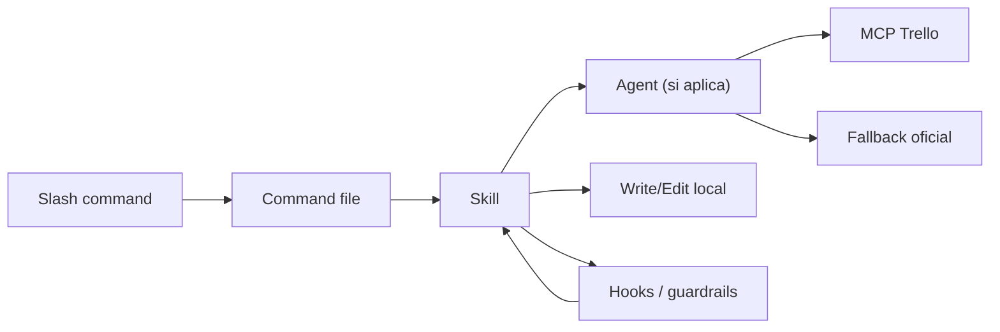
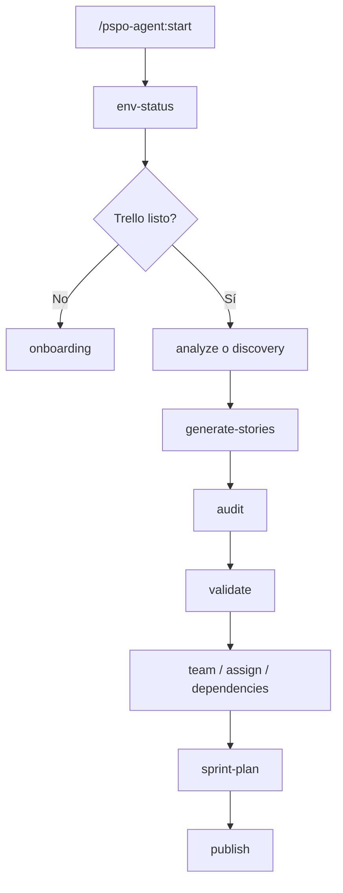
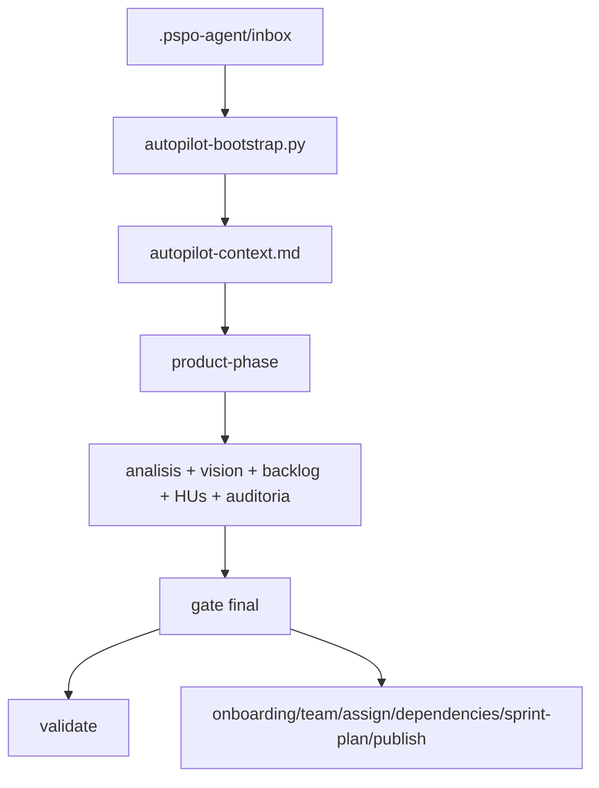

# Arquitectura

## Vista general

PSPO Agent sigue esta cadena:

Piezas principales:

- comandos: [`../commands/`](../commands/)
- skills: [`../skills/`](../skills/)
- agentes: [`../agents/`](../agents/)
- integración Trello: [`../servers/`](../servers/)
- hooks: [`../hooks/`](../hooks/)

## Manifest del plugin

Archivo:

- [`../.claude-plugin/plugin.json`](../.claude-plugin/plugin.json)

Declara:

- nombre, versión, homepage, keywords
- `commands`
- `skills`
- `agents`
- `mcpServers`

## Dos modos de operación

### 1. Flujo guiado

Entrada habitual:

- [`../commands/start.md`](../commands/start.md)
- [`../skills/start/SKILL.md`](../skills/start/SKILL.md)

Recorrido típico:

### 2. Flujo autónomo

Entrada:

- [`../commands/autopilot.md`](../commands/autopilot.md)
- [`../skills/autopilot/SKILL.md`](../skills/autopilot/SKILL.md)

Recorrido real:

## Fase de producto no interactiva

Skill:

- [`../skills/product-phase/SKILL.md`](../skills/product-phase/SKILL.md)

Responsabilidades:

- consolidar contexto de entrada
- escribir `docs/analisis-requisitos.md`
- escribir `docs/vision.md`
- escribir `docs/backlog.md`
- generar `docs/historias/HU-*.md`
- escribir `docs/auditoria-hu.md`

Reglas:

- no usa `Task`
- no usa `Agent`
- no usa Trello
- no relee la inbox una vez fijado el runtime

## Artefactos locales

Salida operativa principal:

- `docs/analisis-requisitos.md`
- `docs/vision.md`
- `docs/backlog.md`
- `docs/historias/HU-*.md`
- `docs/auditoria-hu.md`
- `docs/asignaciones.md`
- `docs/dependencias.md`
- `docs/sprint-plan.md`
- `docs/publish-report.md`

Generación y persistencia:

- [`../skills/save-docs/SKILL.md`](../skills/save-docs/SKILL.md)
- [`../skills/save-docs/file-templates.md`](../skills/save-docs/file-templates.md)

## Runtime de autopilot

Directorio de estado:

- `.pspo-agent/runtime/`

Ficheros relevantes:

| Fichero | Uso |
|---|---|
| `autopilot-context.md` | contexto consolidado de entrada |
| `product-phase.status` | `active` o `done` |
| `final-gate.status` | `pending`, `review`, `plan-publish`, `done` |
| `autopilot-branch-skill.status` | skill hija seleccionada tras la gate |
| `active-skill.status` | skill PSPO activa |
| `start-bootstrap.status` | bootstrap de `start` |
| `onboarding-bootstrap.status` | bootstrap de `onboarding` |
| `trello-fallback.sh` | wrapper runtime al fallback oficial |

Lógica de estado:

- [`../hooks/scripts/autopilot-guard.py`](../hooks/scripts/autopilot-guard.py)

## Estilo de arquitectura

El diseño actual intenta que el sistema mande más que el modelo:

- guardrails en hooks
- runtime persistido en disco
- Trello encapsulado en MCP/fallback oficial
- menos delegación libre en `autopilot`
- más rutas deterministas en `product-phase` y `publish`

