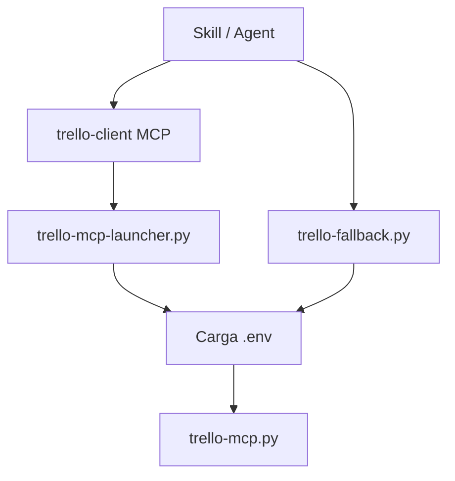

# Integración con Trello

## Componentes

Archivos principales:

- launcher MCP: [`../servers/trello-mcp-launcher.py`](../servers/trello-mcp-launcher.py)
- servidor MCP: [`../servers/trello-mcp.py`](../servers/trello-mcp.py)
- fallback oficial: [`../servers/trello-fallback.py`](../servers/trello-fallback.py)
- registro MCP: [`../.mcp.json`](../.mcp.json)

## Cómo funciona

El fallback oficial existe para estos casos:

- `trello-client` no arranca
- el entorno de Claude no expone el MCP correctamente
- `autopilot` necesita un carril más determinista en publicación

## Herramientas MCP

Fuente:

- [`../servers/trello-mcp.py`](../servers/trello-mcp.py)

| Tool | Uso |
|---|---|
| `verify-credentials` | valida API key y token |
| `list-boards` | lista tableros |
| `get-board` | obtiene listas y etiquetas |
| `get-card` | obtiene tarjeta con miembros, adjuntos y checklists |
| `create-board` | crea tablero |
| `manage-lists` | create, rename, reorder, archive |
| `manage-labels` | create, update, rename, delete |
| `create-cards` | crea una o varias tarjetas |
| `search-cards` | busca duplicados o coincidencias |
| `update-card` | sincroniza descripción, lista, etiquetas y miembros |
| `add-checklist` | añade checklist |
| `attach-file` | adjunta `.md` |
| `get-board-members` | lista miembros e IDs |
| `invite-member` | invita por email |

## Normas del tablero

Listas estándar:

- `Backlog`
- `Sprint activo`
- `Bloqueada`
- `En progreso`
- `En revision`
- `Hecho`

Etiquetas de prioridad:

- `Critica`
- `Alta`
- `Media`
- `Baja`

Etiquetas operativas:

- `Asignada`
- `Bloqueada`
- `Bloqueante`

## Contrato de publicación

Referencias:

- [`../skills/publish/SKILL.md`](../skills/publish/SKILL.md)
- [`../agents/publisher.md`](../agents/publisher.md)
- [`../skills/publish/card-format.md`](../skills/publish/card-format.md)

Una tarjeta correcta debe incluir como mínimo:

1. resumen corto en la descripción
2. fichero `.md` adjunto
3. `idMembers` real si la HU tiene owner

Si hay dependencias confirmadas:

- checklist `Dependencias`

Si existe DoD:

- checklist `Definition of Done`

## Compatibilidad y tolerancia

El servidor normaliza algunas variaciones razonables para no romper el flujo:

- `create-card` se normaliza a `create-cards` en el fallback
- payload singular con `idList`, `name`, `desc` se normaliza a lista de `cards`
- `manage-labels` acepta `rename` como alias de `update`

Referencias:

- [`../servers/trello-fallback.py`](../servers/trello-fallback.py)
- [`../servers/trello-mcp.py`](../servers/trello-mcp.py)

## Credenciales

El launcher carga:

- `TRELLO_API_KEY`
- `TRELLO_TOKEN`
- `TRELLO_BOARD_ID`
- `TRELLO_TOKEN_CREATED`

desde el `.env` del proyecto activo.

No hace falta exportarlas a mano en cada sesión si el `.env` existe y es válido.

