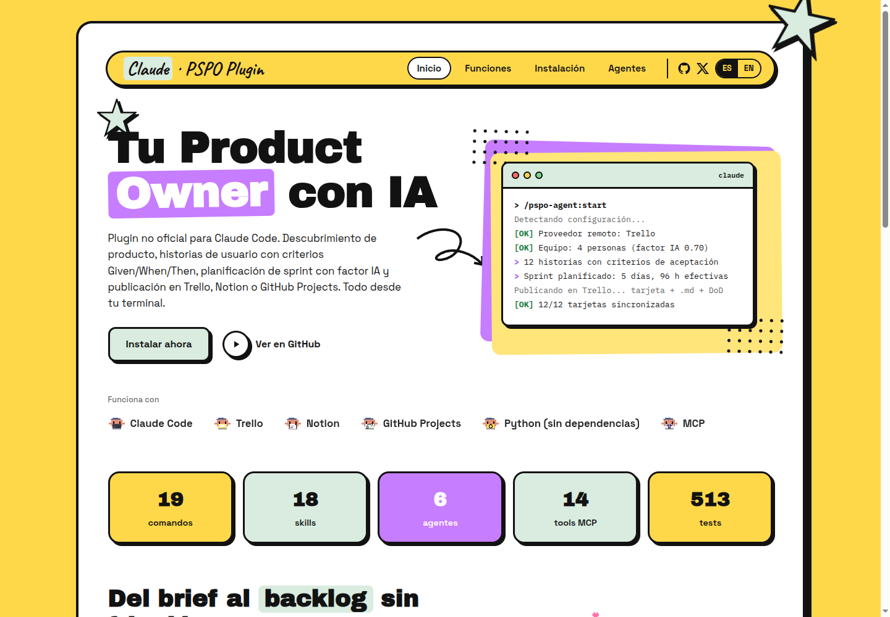

# PSPO Agent

Plugin no oficial de Product Owner profesional para Claude Code. Analisis de requisitos, descubrimiento de producto, historias de usuario con criterios Given/When/Then, asignacion operativa, mapa de dependencias, planificacion de sprint con factor de productividad por agentes IA, y publicacion remota en Trello, Notion o GitHub Projects.

[](https://pspo-agent.com)

Web oficial: [pspo-agent.com](https://pspo-agent.com) (español) · [pspo-agent.com/en](https://pspo-agent.com/en/) (english)

## Documentacion del plugin

La documentacion tecnica y de desarrollador vive en:

- [`Documents/README.md`](./Documents/README.md)

Importante:

- `Documents/` = documentacion del plugin
- `docs/` = artefactos generados por el flujo de producto

## Requisitos

- Python 3.8+ (accesible como `python3` o `python`)
- Claude Code
- En Windows: Git para Windows (los hooks usan su bash a traves del envoltorio `hooks/run-hook.cmd`)

## Instalacion

Un solo comando:

**Linux / macOS**

```bash
curl -fsSL https://raw.githubusercontent.com/686f6c61/PSPO-Agent/main/install.sh | bash
```

**Windows (PowerShell)**

```powershell
irm https://raw.githubusercontent.com/686f6c61/PSPO-Agent/main/install.ps1 | iex
```

## Primer uso

Reinicia Claude Code y ejecuta:

```
/pspo-agent:start
```

El asistente de onboarding te guiara para configurar el proveedor remoto, validar credenciales y dejar listo el destino de publicacion.

## Proveedores de publicación

Estado actual:

- `trello`: integrado y validado
- `notion`: integrado y validado para flujo zero-template
- `github`: integrado (GitHub Projects v2 privado). Requiere `gh` autenticado con scope `project` o `GITHUB_TOKEN`/`GH_TOKEN` con ese scope
- `local`: artefactos solo en `docs/`

La documentación de esta capa vive en:

- [`Documents/notion-integration.md`](./Documents/notion-integration.md)
- [`Documents/github-projects-integration.md`](./Documents/github-projects-integration.md)

## Skills disponibles

| Skill | Comando | Descripcion |
|-------|---------|-------------|
| analyze | `/pspo-agent:analyze` | Analiza un documento crudo (brief, email, PRD) hasta alcanzar un 80% de claridad en 8 categorias. |
| start | `/pspo-agent:start` | Punto de entrada. Detecta configuracion y redirige al flujo correcto. |
| onboarding | `/pspo-agent:onboarding` | Asistente guiado: proveedor remoto (Trello, Notion o GitHub Projects), credenciales y destino de publicacion. |
| discovery | `/pspo-agent:discovery` | Preguntas de descubrimiento desde cero (sin documento de partida). |
| generate-stories | `/pspo-agent:generate-stories` | Genera historias con criterios de aceptacion Given/When/Then. |
| validate | `/pspo-agent:validate` | Revision historia por historia: aprobar, rechazar o pedir cambios. |
| publish | `/pspo-agent:publish` | Publica en el proveedor remoto activo con resumen + adjunto .md + dependencias y asignacion real cuando aplica. |
| save-docs | `/pspo-agent:save-docs` | Guarda artefactos de producto en Markdown local. |
| update | `/pspo-agent:update` | Comprueba y aplica actualizaciones del plugin. |
| team | `/pspo-agent:team` | Gestion de equipo: CSV con dedicacion y uso de agentes IA. |
| assign | `/pspo-agent:assign` | Propone y guarda la asignacion de historias al equipo. |
| dependencies | `/pspo-agent:dependencies` | Detecta y persiste dependencias, bloqueantes e impacto por persona. |
| sprint-plan | `/pspo-agent:sprint-plan` | Planificacion de sprint: DoD, estimacion en horas efectivas, capacidad con factor IA. |
| autopilot | `/pspo-agent:autopilot` | Lee una carpeta con instrucciones + cualquier CSV de equipo compatible y ejecuta el flujo autonomamente hasta la gate final. |
| sprint-review | `/pspo-agent:sprint-review` | Revision de sprint: estado de tarjetas y cumplimiento de DoD. |
| export | `/pspo-agent:export` | Exportacion a CSV, JSON y Jira CSV. |
| audit | `/pspo-agent:audit` | Auditoria senior: completitud, coherencia, HU que faltan/sobran. |

## Agentes

| Agente | Responsabilidad |
|--------|----------------|
| requirement-analyst | Interroga documentos hasta alcanzar claridad suficiente para generar historias. |
| product-owner | Descubrimiento de producto, generacion de historias y validacion. |
| publisher | Publicacion operativa en Trello; Notion y GitHub Projects usan fallback oficial zero-template desde la skill `publish`. |
| sprint-planner | DoD, equipo, capacidad con factor IA y planificacion de sprint. |
| culture-guardian | Revisor de estilo: normas RAE, tono profesional, aprende del proyecto. |
| senior-auditor | Auditoria de fondo: completitud, coherencia, HU que faltan/sobran. |

## Integracion remota

Trello se opera con 12 herramientas operativas + 2 de sincronizacion via MCP en Python puro (stdlib, 0 dependencias):

| Herramienta | Proposito |
|-------------|-----------|
| verify-credentials | Verificar API Key + Token |
| list-boards | Listar tableros del usuario |
| get-board | Obtener tablero con listas y etiquetas |
| create-board | Crear tablero nuevo |
| manage-lists | Crear, renombrar, reordenar, archivar listas |
| manage-labels | Crear, actualizar, eliminar etiquetas |
| create-cards | Crear tarjetas con etiquetas y miembros asignados |
| search-cards | Buscar tarjetas por titulo (deteccion de duplicados) |
| add-checklist | Anadir checklist de DoD a tarjetas |
| attach-file | Adjuntar fichero .md completo a tarjetas |
| get-board-members | Obtener miembros del tablero con sus IDs |
| invite-member | Invitar miembros al tablero por email |
| get-card | Obtener tarjeta existente (sincronizacion incremental) |
| update-card | Actualizar tarjeta existente sin duplicar |

Notion se opera por fallback oficial zero-template desde:

- `servers/notion-fallback.py`
- `.pspo-agent/runtime/notion-fallback.sh`

GitHub Projects v2 se opera por fallback oficial zero-template desde:

- `servers/github-fallback.py`
- `.pspo-agent/runtime/github-fallback.sh`

Backend primario: la CLI `gh` (`gh api graphql`); fallback a GraphQL directo con `GITHUB_TOKEN`/`GH_TOKEN`.

## Hooks de seguridad y runtime

| Hook | Evento | Funcion |
|------|--------|---------|
| check-env.sh | PreToolUse (MCP trello-client) | Bloquea llamadas MCP si faltan credenciales en .env |
| block-autopilot-trello.sh | PreToolUse (MCP trello-client) | Impide publicar en Trello antes de la gate final de autopilot |
| block-trello-bash.sh | PreToolUse (Bash, WebFetch) | Bloquea acceso directo a Trello fuera del MCP |
| block-secret-prompt-leak.py | PreToolUse (Agent, Task) | Impide que se filtren credenciales en prompts de subagentes |
| block-autopilot-agent.sh | PreToolUse (Agent, Task) | Restringe delegaciones fuera del carril de autopilot |
| block-autopilot-drift.sh | PreToolUse (Read, Glob, ToolSearch, TodoWrite) | Evita exploracion lateral durante autopilot |
| warn-sensitive-read.sh | PreToolUse (Read) | Avisa cuando se intenta leer .env u otros ficheros sensibles |
| persist-active-skill.py | PreToolUse (Skill) | Persiste la skill activa en el runtime |
| block-autopilot-skill.sh | PreToolUse (Skill) | Valida que la skill invocada corresponde a la fase de autopilot |
| block-onboarding-credential-reask.py | PreToolUse (AskUserQuestion) | Evita volver a pedir credenciales ya configuradas |
| persist-autopilot-gate.py | PostToolUse (AskUserQuestion) | Persiste la decision de la gate final de autopilot |
| check-gitignore.sh | PostToolUse (Write) | Verifica que .env esta en .gitignore |
| autopilot-stop.py | Stop | Impide cerrar el flujo autopilot antes de materializar los artefactos |

## Configuracion

El fichero `settings.json` permite personalizar el comportamiento del plugin:

| Parametro | Defecto | Descripcion |
|-----------|---------|-------------|
| sprint.ai_agent_factor | 0.65 | Factor de productividad con agentes IA (65%) |
| sprint.ai_agent_factor_recommended | 0.70 | Factor recomendado (70%) |
| sprint.ai_agent_factor_range | [0.30, 0.80] | Rango configurable |
| sprint.duration_days | 5 | Duracion por defecto del sprint en dias laborables |
| stories.estimation_sizes | XS=1, S=2, M=4, L=8, XL=16 | Tallas en horas efectivas con agentes |
| sprint.focus_hours_per_day | 6 | Horas reales productivas por dia para el calculo de capacidad |
| trello.default_lists | Backlog, Sprint activo, Bloqueada, En progreso, En revision, Hecho | Columnas por defecto |
| trello.default_labels | Critica, Alta, Media, Baja | Etiquetas de prioridad |
| github.project_title_prefix | PSPO | Prefijo del titulo del Project v2 privado |
| github.status_options | Backlog, Sprint activo, Bloqueada, En progreso, En revision, Hecho | Estados del kanban de GitHub Projects |
| docs.date_format | DD/MM/AAAA | Formato de fechas |

## Estructura del proyecto

```
pspo-agent/
├── .claude-plugin/
│   ├── plugin.json
│   └── marketplace.json
├── agents/                  # 6 agentes especializados
├── skills/                  # 18 skills
├── servers/
│   ├── trello-mcp.py        # Servidor MCP Trello
│   ├── trello-mcp-launcher.py
│   ├── trello-fallback.py   # Fallback oficial Trello
│   ├── notion-fallback.py   # Fallback oficial Notion
│   └── github-fallback.py   # Fallback oficial GitHub Projects
├── hooks/
│   ├── run-hook.cmd         # envoltorio poliglota (Windows/macOS/Linux)
│   └── scripts/             # hooks de runtime y seguridad
├── tests/                   # tests unitarios, de contenido y runtime
├── Documents/               # documentación viva del plugin
├── docs/                    # artefactos generados por el flujo de producto
├── landing/                 # web bilingue de pspo-agent.com (ES/EN)
├── public/                  # imagenes del README
├── .mcp.json
├── .env.example
├── settings.json
├── install.sh               # Instalador Linux/macOS
├── install.ps1              # Instalador Windows
├── uninstall.sh
└── uninstall.ps1
```

## Conformidad con el SDK de Anthropic y buenas practicas

El plugin esta construido sobre la especificacion oficial de plugins de Claude Code
(el ecosistema del Agent SDK de Anthropic) y sigue sus buenas practicas publicadas:

- **Manifiesto minimo con autodescubrimiento:** `plugin.json` solo declara metadatos y
  `mcpServers`; comandos, skills y agentes se descubren desde los directorios estandar,
  asi que anadir un componente no exige tocar el manifiesto.
- **Validacion estricta:** `claude plugin validate . --strict` pasa sin avisos, tanto para
  el manifiesto del plugin como para el del marketplace.
- **Skills con divulgacion progresiva:** cada `SKILL.md` declara su condicion de disparo
  ("Usar cuando...") y delega el detalle en ficheros auxiliares que se leen bajo demanda.
- **Hooks con el esquema vigente:** decisiones `permissionDecision` en PreToolUse, gate de
  `Stop` para autopilot, y envoltorio poliglota `run-hook.cmd` para que los guardarrailes
  funcionen igual en Linux, macOS y Windows.
- **MCP en Python puro:** servidor JSON-RPC sobre stdio con stdlib exclusivamente, sin
  dependencias que instalar.
- **Verificacion continua:** 514 tests (unitarios, contenido, protocolo MCP end-to-end y
  runtime de hooks) que se ejecutan con `pytest` antes de cada release.

## Desinstalacion

**Linux / macOS**

```bash
bash uninstall.sh
```

**Windows (PowerShell)**

```powershell
.\uninstall.ps1
```

## Descargo de responsabilidad

PSPO Agent es una herramienta experimental que utiliza inteligencia artificial para generar
artefactos de producto. **No sustituye el criterio profesional** de un Product Owner certificado
ni de ningun rol de gestion de producto.

El contenido generado (historias de usuario, criterios de aceptacion, documentacion) es una
sugerencia automatizada que el usuario debe revisar, validar y aprobar antes de utilizarlo.
El usuario es el unico responsable de las decisiones de producto y de la informacion publicada
en Trello o cualquier otro sistema.

Este proyecto **no esta afiliado, asociado ni respaldado** por Anthropic (Claude), Atlassian
(Trello), Notion Labs, GitHub ni Scrum.org (PSPO). Las marcas mencionadas pertenecen a sus
respectivos propietarios.

El software se proporciona "tal cual", sin garantia de ningun tipo, expresa o implicita.

## Licencia

MIT

## Web

[https://pspo-agent.com](https://pspo-agent.com)
