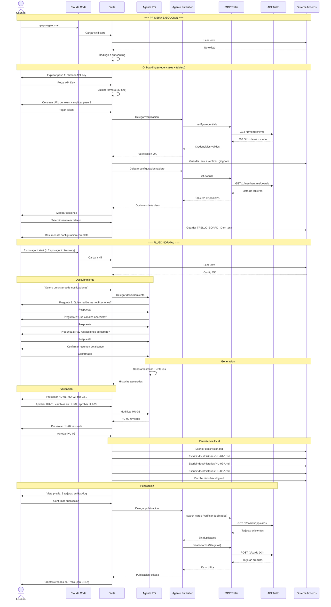

# Arquitectura: PSPO Agent -- Plugin de Claude Code

> Nota de estado (2026-03-15): este documento se conserva como historial de diseño. Varias secciones siguen describiendo la etapa previa a la migracion completa del MCP a Python y no reflejan fielmente el estado actual del plugin. Usalo como referencia historica hasta su reescritura.
>
> Fuente tecnica actual: `Documents/architecture.md`.

| Campo | Valor |
|-------|-------|
| **Autor** | El Dibujante de Cajas (Arquitecto) |
| **Fecha** | 2026-03-13 |
| **Estado** | Propuesto |
| **Version** | 1.0 |
| **PRD de referencia** | docs/prd.md v1.0 |

---

## 1. Vision general

PSPO Agent es un **plugin de Claude Code** que actua como Product Owner profesional. El plugin se distribuye como un directorio autocontenido que sigue la estructura oficial de plugins de Claude Code (`.claude-plugin/plugin.json` + directorios de skills, agentes y hooks).

El plugin NO implementa logica de negocio en codigo compilado. Opera como un conjunto coordinado de **skills** (instrucciones estructuradas en Markdown) que guian el comportamiento del LLM, combinado con un **servidor MCP** ligero para la integracion con la API de Trello.

### Principio arquitectonico central

> Separacion de responsabilidades. No es negociable.

- **Skills:** Contienen la inteligencia de producto (prompts especializados para descubrimiento, generacion, validacion).
- **Servidor MCP:** Es la unica pieza que ejecuta codigo. Encapsula toda la comunicacion HTTP con Trello.
- **Agentes:** Definen los roles especializados (PO para descubrimiento, Publicador para Trello).
- **Hooks:** Automatizan validaciones (comprobar .env antes de publicar, verificar .gitignore).

Si no esta en el diagrama, no existe. Vamos con los diagramas.

---

## 2. Diagrama de componentes

```mermaid
flowchart TB
    subgraph Plugin["PSPO Agent Plugin"]
        direction TB

        subgraph Skills["Skills (Markdown + prompts)"]
            SK_ONBOARD["onboarding<br/>Guia de primera ejecucion"]
            SK_DISCOVER["discovery<br/>Preguntas de descubrimiento"]
            SK_GENERATE["generate-stories<br/>Generacion de HU"]
            SK_VALIDATE["validate<br/>Revision y aprobacion"]
            SK_PUBLISH["publish<br/>Publicacion en Trello"]
            SK_DOCS["save-docs<br/>Persistencia local"]
        end

        subgraph Agents["Agentes (subagentes especializados)"]
            AG_PO["product-owner<br/>Rol PSPO: descubrimiento + generacion"]
            AG_PUB["publisher<br/>Rol tecnico: interaccion con Trello"]
        end

        subgraph Hooks["Hooks (automatizaciones)"]
            HK_ENV["PreToolUse<br/>Validar .env antes de Trello"]
            HK_GIT["PostToolUse<br/>Verificar .gitignore tras Write"]
        end

        subgraph MCP["Servidor MCP (trello-client)"]
            MCP_AUTH["verify-credentials<br/>Verificar API Key + Token"]
            MCP_BOARDS["list-boards<br/>Listar tableros"]
            MCP_BOARD["get-board<br/>Obtener tablero + listas"]
            MCP_CREATE_BOARD["create-board<br/>Crear tablero nuevo"]
            MCP_LISTS["manage-lists<br/>Crear/renombrar columnas"]
            MCP_LABELS["manage-labels<br/>Crear/gestionar etiquetas"]
            MCP_CARDS["create-cards<br/>Crear tarjetas"]
            MCP_SEARCH["search-cards<br/>Buscar tarjetas existentes"]
        end

        MANIFEST[".claude-plugin/plugin.json<br/>Manifiesto del plugin"]
    end

    subgraph External["Servicios externos"]
        TRELLO_API["API REST de Trello v1<br/>api.trello.com"]
    end

    subgraph Local["Sistema de ficheros local"]
        ENV[".env<br/>Credenciales"]
        DOCS["docs/<br/>Artefactos de producto"]
        GITIGNORE[".gitignore"]
    end

    subgraph User["Usuario"]
        CLI["Claude Code CLI<br/>Terminal interactivo"]
    end

    %% Relaciones usuario -> plugin
    CLI -->|"/pspo-agent:start"| SK_ONBOARD
    CLI -->|"/pspo-agent:discover"| SK_DISCOVER
    CLI -->|"/pspo-agent:generate"| SK_GENERATE
    CLI -->|"/pspo-agent:validate"| SK_VALIDATE
    CLI -->|"/pspo-agent:publish"| SK_PUBLISH

    %% Relaciones skills -> agentes
    SK_DISCOVER -.->|"Usa agente"| AG_PO
    SK_GENERATE -.->|"Usa agente"| AG_PO
    SK_PUBLISH -.->|"Usa agente"| AG_PUB

    %% Relaciones agentes -> MCP
    AG_PUB -->|"Herramientas MCP"| MCP

    %% MCP -> Trello
    MCP_AUTH -->|"HTTPS"| TRELLO_API
    MCP_BOARDS -->|"HTTPS"| TRELLO_API
    MCP_BOARD -->|"HTTPS"| TRELLO_API
    MCP_CREATE_BOARD -->|"HTTPS"| TRELLO_API
    MCP_LISTS -->|"HTTPS"| TRELLO_API
    MCP_LABELS -->|"HTTPS"| TRELLO_API
    MCP_CARDS -->|"HTTPS"| TRELLO_API
    MCP_SEARCH -->|"HTTPS"| TRELLO_API

    %% Plugin -> ficheros locales
    SK_ONBOARD -->|"Lee/escribe"| ENV
    SK_DOCS -->|"Escribe"| DOCS
    HK_GIT -->|"Verifica"| GITIGNORE

    %% Hooks -> validaciones
    HK_ENV -.->|"Valida antes de"| MCP
```



### Leyenda del diagrama

| Elemento | Significado |
|----------|-------------|
| Rectangulo con borde solido | Componente del plugin |
| Flecha solida (`-->`) | Flujo de datos o invocacion directa |
| Flecha punteada (`.->`) | Delegacion o uso indirecto |
| Subgrafo coloreado | Agrupacion logica de componentes |
| Servicio externo | Dependencia fuera del control del plugin |

---

## 3. Diagrama de flujo de datos

Este diagrama muestra el viaje completo de la informacion desde la primera ejecucion hasta la publicacion en Trello.

```mermaid
flowchart TD
    START([Usuario ejecuta<br/>cualquier comando del plugin]) --> CHECK_ENV{Existe .env con<br/>TRELLO_API_KEY +<br/>TRELLO_TOKEN?}

    %% Rama de onboarding
    CHECK_ENV -->|No| ONBOARD_START["Iniciar asistente<br/>de onboarding"]
    ONBOARD_START --> STEP_KEY["Paso 1: Guiar obtencion<br/>de API Key"]
    STEP_KEY --> USER_KEY["Usuario pega API Key"]
    USER_KEY --> VALIDATE_KEY{"Formato valido?<br/>(32 hex)"}
    VALIDATE_KEY -->|No| STEP_KEY
    VALIDATE_KEY -->|Si| STEP_TOKEN["Paso 2: Construir URL<br/>de autorizacion"]
    STEP_TOKEN --> USER_TOKEN["Usuario pega Token"]
    USER_TOKEN --> VERIFY_CREDS["MCP: verify-credentials<br/>GET /1/members/me"]
    VERIFY_CREDS --> CREDS_OK{HTTP 200?}
    CREDS_OK -->|No| RETRY["Mostrar error<br/>+ reintentar"]
    RETRY --> STEP_KEY
    CREDS_OK -->|Si| SAVE_ENV["Guardar en .env<br/>+ verificar .gitignore"]

    %% Configuracion de tablero
    SAVE_ENV --> CHECK_BOARD{Existe<br/>TRELLO_BOARD_ID?}
    CHECK_BOARD -->|No| BOARD_CHOICE{"Crear tablero<br/>nuevo o usar<br/>existente?"}
    BOARD_CHOICE -->|Nuevo| CREATE_BOARD["MCP: create-board<br/>+ crear columnas<br/>+ crear etiquetas"]
    BOARD_CHOICE -->|Existente| LIST_BOARDS["MCP: list-boards"]
    LIST_BOARDS --> SELECT_BOARD["Usuario selecciona tablero"]
    SELECT_BOARD --> CHECK_COLUMNS["MCP: get-board<br/>Analizar columnas"]
    CHECK_COLUMNS --> OFFER_COLUMNS{"Faltan columnas<br/>estandar?"}
    OFFER_COLUMNS -->|Si| ADD_COLUMNS["MCP: manage-lists<br/>Anadir columnas"]
    OFFER_COLUMNS -->|No| SAVE_BOARD
    ADD_COLUMNS --> SAVE_BOARD
    CREATE_BOARD --> SAVE_BOARD["Guardar TRELLO_BOARD_ID<br/>en .env"]
    SAVE_BOARD --> ONBOARD_DONE["Mostrar resumen<br/>Onboarding completo"]

    %% Flujo normal
    CHECK_ENV -->|Si| VERIFY_SILENT["MCP: verify-credentials<br/>(silencioso)"]
    VERIFY_SILENT --> SILENT_OK{Validas?}
    SILENT_OK -->|No| ONBOARD_START
    SILENT_OK -->|Si| CHECK_BOARD_EXIST{TRELLO_BOARD_ID<br/>existe y es valido?}
    CHECK_BOARD_EXIST -->|No| CHECK_BOARD
    CHECK_BOARD_EXIST -->|Si| FLOW_START

    ONBOARD_DONE --> FLOW_START

    %% Descubrimiento
    FLOW_START(["Flujo principal"]) --> DISCOVER_INPUT["Usuario describe<br/>necesidad en<br/>lenguaje natural"]
    DISCOVER_INPUT --> DISCOVER_QUESTIONS["Agente PO formula<br/>preguntas de<br/>descubrimiento"]
    DISCOVER_QUESTIONS --> USER_ANSWERS["Usuario responde"]
    USER_ANSWERS --> ENOUGH{Alcance<br/>definido?}
    ENOUGH -->|No| DISCOVER_FOLLOWUP["Preguntas de<br/>seguimiento"]
    DISCOVER_FOLLOWUP --> USER_ANSWERS
    ENOUGH -->|Si| CONFIRM_SCOPE["Confirmar puntos<br/>clave con usuario"]

    %% Generacion
    CONFIRM_SCOPE --> GENERATE["Agente PO genera<br/>historias de usuario<br/>+ criterios de aceptacion"]
    GENERATE --> STORIES[("Historias de usuario<br/>(en memoria)")]

    %% Validacion
    STORIES --> PRESENT["Presentar resumen<br/>estructurado"]
    PRESENT --> USER_REVIEW{"Aprobacion<br/>por historia"}
    USER_REVIEW -->|Cambios| MODIFY["Modificar historia<br/>segun feedback"]
    MODIFY --> PRESENT
    USER_REVIEW -->|Rechazar| REMOVE["Descartar historia"]
    USER_REVIEW -->|Aprobar| APPROVED[("Historias aprobadas")]

    %% Guardado local
    APPROVED --> SAVE_LOCAL["Guardar en docs/<br/>vision.md + historias/<br/>+ backlog.md"]

    %% Publicacion
    SAVE_LOCAL --> PREVIEW["Mostrar vista previa<br/>de tarjetas a crear"]
    PREVIEW --> CONFIRM_PUBLISH{Usuario confirma?}
    CONFIRM_PUBLISH -->|No| END_LOCAL(["Fin: solo local"])
    CONFIRM_PUBLISH -->|Si| CHECK_DUPLICATES["MCP: search-cards<br/>Verificar duplicados"]
    CHECK_DUPLICATES --> PUBLISH["MCP: create-cards<br/>Publicar en Trello"]
    PUBLISH --> PUBLISH_OK{Exito?}
    PUBLISH_OK -->|Si| SHOW_RESULT["Mostrar URLs<br/>de tarjetas creadas"]
    PUBLISH_OK -->|No| ERROR_SAVE["Guardar para<br/>reintentar despues"]
    ERROR_SAVE --> SHOW_ERROR["Mostrar error<br/>descriptivo"]
    SHOW_RESULT --> END_OK(["Fin: publicado"])
    SHOW_ERROR --> END_ERROR(["Fin: guardado local,<br/>pendiente de publicar"])
```



### Leyenda del flujo

| Forma | Significado |
|-------|-------------|
| Rectangulo redondeado `([...])` | Inicio o fin del flujo |
| Rombo `{...}` | Decision (bifurcacion) |
| Rectangulo `[...]` | Accion o proceso |
| Cilindro `((...))` | Datos en memoria/almacenamiento |

---

## 4. Estructura de directorios del plugin

```
pspo-agent/
|-- .claude-plugin/
|   +-- plugin.json                    # Manifiesto del plugin
|
|-- skills/
|   |-- start/
|   |   +-- SKILL.md                   # Punto de entrada: detecta estado y redirige
|   |-- onboarding/
|   |   |-- SKILL.md                   # Asistente de primera ejecucion
|   |   +-- steps.md                   # Instrucciones detalladas paso a paso
|   |-- discovery/
|   |   |-- SKILL.md                   # Preguntas de descubrimiento
|   |   +-- question-bank.md           # Banco de preguntas por categoria
|   |-- generate-stories/
|   |   |-- SKILL.md                   # Generacion de HU + criterios
|   |   +-- templates.md               # Plantillas y ejemplos de formato
|   |-- validate/
|   |   |-- SKILL.md                   # Presentacion y revision
|   |   +-- checklist.md               # Checklist de calidad de historias
|   |-- publish/
|   |   |-- SKILL.md                   # Vista previa + publicacion
|   |   +-- card-format.md             # Formato de tarjetas de Trello
|   +-- save-docs/
|       |-- SKILL.md                   # Persistencia en docs/
|       +-- file-templates.md          # Plantillas de ficheros Markdown
|
|-- agents/
|   |-- product-owner.md               # Agente PO: descubrimiento + generacion
|   +-- publisher.md                   # Agente publicador: interaccion con Trello
|
|-- hooks/
|   +-- hooks.json                     # Validaciones automaticas
|
|-- servers/
|   +-- trello-mcp/                    # Servidor MCP para Trello
|       |-- package.json
|       |-- tsconfig.json
|       +-- src/
|           |-- index.ts               # Punto de entrada del servidor MCP
|           |-- trello-client.ts       # Cliente HTTP para la API de Trello
|           |-- tools/
|           |   |-- verify-credentials.ts
|           |   |-- list-boards.ts
|           |   |-- get-board.ts
|           |   |-- create-board.ts
|           |   |-- manage-lists.ts
|           |   |-- manage-labels.ts
|           |   |-- create-cards.ts
|           |   +-- search-cards.ts
|           +-- types/
|               +-- trello.ts          # Tipos de la API de Trello
|
|-- .mcp.json                          # Configuracion del servidor MCP
|-- settings.json                      # Configuracion por defecto del plugin
+-- LICENSE
```

---

## 5. Componentes en detalle

### 5.1. Manifiesto del plugin (`.claude-plugin/plugin.json`)

```json
{
  "name": "pspo-agent",
  "description": "Product Owner profesional (PSPO) para Claude Code. Descubrimiento de producto, generacion de historias de usuario con criterios de aceptacion, y publicacion en Trello.",
  "version": "1.0.0",
  "author": {
    "name": "PSPO AI Team"
  },
  "repository": "https://github.com/pspo-ai/pspo-agent",
  "license": "MIT",
  "keywords": ["product-owner", "scrum", "trello", "user-stories", "backlog"]
}
```

El nombre `pspo-agent` establece el namespace. Todas las skills se invocan como `/pspo-agent:nombre`.

### 5.2. Skills

Cada skill es un directorio dentro de `skills/` con un fichero `SKILL.md` como punto de entrada. Las skills son la inteligencia del plugin: contienen prompts especializados que guian al LLM.

| Skill | Comando | Invocacion | Proposito |
|-------|---------|------------|-----------|
| `start` | `/pspo-agent:start` | Usuario | Punto de entrada. Detecta estado (.env, tablero) y redirige al flujo correcto |
| `onboarding` | `/pspo-agent:onboarding` | Usuario | Asistente guiado de primera ejecucion (HU-01, HU-01b) |
| `discovery` | `/pspo-agent:discovery` | Usuario | Preguntas de descubrimiento de producto (HU-02) |
| `generate-stories` | `/pspo-agent:generate-stories` | Claude (auto) | Generacion de HU con criterios de aceptacion (HU-03) |
| `validate` | `/pspo-agent:validate` | Claude (auto) | Presentacion para revision y aprobacion (HU-04) |
| `publish` | `/pspo-agent:publish` | Usuario | Vista previa y publicacion en Trello (HU-05) |
| `save-docs` | `/pspo-agent:save-docs` | Claude (auto) | Persistencia de artefactos en docs/ (HU-06) |

**Ejemplo de SKILL.md (discovery):**

```yaml
---
name: discovery
description: >
  Inicia el proceso de descubrimiento de producto. Hace preguntas estructuradas
  para definir el problema, el usuario objetivo, las restricciones y el alcance
  antes de generar ninguna historia de usuario. Usar cuando el usuario describe
  una idea o necesidad de producto.
disable-model-invocation: false
allowed-tools: Read, Grep, Glob
---
```

**Reglas de invocacion:**

- `start`, `onboarding`, `discovery` y `publish` tienen `disable-model-invocation: false` pero estan pensados para invocacion por el usuario (el usuario inicia el flujo).
- `generate-stories`, `validate` y `save-docs` se encadenan automaticamente desde el flujo de descubrimiento. Claude los usa cuando el contexto lo requiere.

### 5.3. Agentes (subagentes especializados)

Dos agentes especializados mantienen separadas las responsabilidades de "pensar producto" y "interactuar con Trello".

**Agente product-owner (`agents/product-owner.md`):**

```yaml
---
name: product-owner
description: >
  Product Owner profesional certificado PSPO. Experto en descubrimiento de producto,
  formulacion de preguntas de negocio, generacion de historias de usuario con
  criterios de aceptacion en formato Given/When/Then, y priorizacion de backlog.
  Usar cuando se necesite trabajo de producto: descubrimiento, historias, validacion.
model: inherit
tools: Read, Grep, Glob, Write, Edit
---
```

Este agente NO tiene acceso a herramientas MCP de Trello. Su responsabilidad es exclusivamente el trabajo de producto: preguntar, generar, validar. Separacion de responsabilidades.

**Agente publisher (`agents/publisher.md`):**

```yaml
---
name: publisher
description: >
  Agente tecnico especializado en la interaccion con la API de Trello.
  Gestiona la creacion de tarjetas, verificacion de duplicados, y configuracion
  del tablero. Usar cuando se necesite publicar o consultar datos en Trello.
model: inherit
tools: Read, Grep
mcpServers:
  - trello-client
---
```

Este agente tiene acceso al servidor MCP de Trello pero NO puede escribir en el sistema de ficheros (no tiene `Write` ni `Edit`). La unica excepcion: puede leer `.env` para las credenciales. La escritura de configuracion en `.env` la hace el flujo principal a traves de las herramientas estandar de Claude Code.

### 5.4. Servidor MCP (trello-client)

El servidor MCP es la unica pieza del plugin que ejecuta codigo. Es un servidor Node.js/TypeScript que implementa el protocolo MCP sobre stdio y expone herramientas para interactuar con la API REST de Trello.

**Configuracion en `.mcp.json`:**

```json
{
  "mcpServers": {
    "trello-client": {
      "command": "node",
      "args": ["${CLAUDE_PLUGIN_ROOT}/servers/trello-mcp/dist/index.js"],
      "env": {
        "TRELLO_API_KEY": "${TRELLO_API_KEY}",
        "TRELLO_TOKEN": "${TRELLO_TOKEN}"
      }
    }
  }
}
```

**Herramientas expuestas por el servidor MCP:**

| Herramienta | Metodo HTTP | Endpoint de Trello | Entrada | Salida |
|-------------|-------------|-------------------|---------|--------|
| `verify-credentials` | GET | `/1/members/me` | key, token | Nombre usuario, id, URL perfil |
| `list-boards` | GET | `/1/members/me/boards` | key, token | Lista de tableros (id, nombre, URL) |
| `get-board` | GET | `/1/boards/{id}` | boardId | Tablero con listas y etiquetas |
| `create-board` | POST | `/1/boards` | name, defaultLists | Tablero creado (id, URL) |
| `manage-lists` | POST/PUT | `/1/boards/{id}/lists`, `/1/lists/{id}` | boardId, action, params | Lista creada/modificada |
| `manage-labels` | POST/PUT | `/1/boards/{id}/labels`, `/1/labels/{id}` | boardId, action, params | Etiqueta creada/modificada |
| `create-cards` | POST | `/1/cards` | listId, cards[] | Tarjetas creadas (id, URL) |
| `search-cards` | GET | `/1/boards/{id}/cards` + filtro | boardId, query | Tarjetas que coinciden |

**Principios del servidor MCP:**

1. **Sin estado propio.** Las credenciales las recibe del entorno. No almacena nada.
2. **Reintentos con backoff exponencial.** Para errores transitorios (429 rate limit, 5xx).
3. **Errores descriptivos.** Cada error incluye: codigo HTTP, mensaje legible, accion sugerida.
4. **Operaciones atomicas.** Cada herramienta es una operacion autocontenida. Si `create-cards` falla a mitad, devuelve las tarjetas creadas y las pendientes.

### 5.5. Hooks

Automatizaciones que se ejecutan en puntos clave del ciclo de vida.

**`hooks/hooks.json`:**

```json
{
  "hooks": {
    "PreToolUse": [
      {
        "matcher": "mcp__trello-client__.*",
        "hooks": [
          {
            "type": "command",
            "command": "${CLAUDE_PLUGIN_ROOT}/hooks/scripts/check-env.sh"
          }
        ]
      }
    ],
    "PostToolUse": [
      {
        "matcher": "Write",
        "hooks": [
          {
            "type": "command",
            "command": "${CLAUDE_PLUGIN_ROOT}/hooks/scripts/check-gitignore.sh"
          }
        ]
      }
    ]
  }
}
```

| Hook | Evento | Proposito |
|------|--------|-----------|
| `check-env.sh` | PreToolUse (MCP Trello) | Verifica que `.env` existe y tiene las variables necesarias antes de cualquier llamada a Trello |
| `check-gitignore.sh` | PostToolUse (Write) | Si se ha escrito un `.env`, verifica que esta en `.gitignore`. Si no, avisa |

---

## 6. Contratos entre componentes

### 6.1. Interfaz: Skill -> Agente PO

La skill de descubrimiento (`discovery`) delega el trabajo de preguntas al agente `product-owner`. El contrato es:

**Entrada (contexto que recibe el agente):**
- Descripcion de la necesidad en lenguaje natural del usuario.
- Respuestas previas del usuario (si es una iteracion).

**Salida (lo que devuelve el agente):**
- Lista de preguntas de descubrimiento (minimo 3).
- O bien: confirmacion de que el alcance esta definido + resumen de puntos clave.

### 6.2. Interfaz: Skill -> Agente Publisher

La skill de publicacion (`publish`) delega al agente `publisher`. El contrato es:

**Entrada:**
- Lista de historias aprobadas con: titulo, descripcion completa, criterios de aceptacion, prioridad.
- ID del tablero destino (TRELLO_BOARD_ID).
- Nombre de la lista destino (por defecto: "Backlog").

**Salida:**
- Lista de tarjetas creadas con: id, titulo, URL.
- Lista de tarjetas omitidas por duplicado.
- Errores si los hay, con tarjetas pendientes.

### 6.3. Interfaz: Agente Publisher -> Servidor MCP

El agente publisher invoca herramientas MCP del servidor `trello-client`. Cada herramienta tiene un esquema de entrada/salida definido por el protocolo MCP.

**Ejemplo de `create-cards`:**

```typescript
// Entrada (tool_input)
interface CreateCardsInput {
  listId: string;
  cards: Array<{
    name: string;          // Titulo de la tarjeta
    desc: string;          // Descripcion en Markdown
    idLabels?: string[];   // IDs de etiquetas
    pos?: "top" | "bottom"; // Posicion en la lista
  }>;
}

// Salida (tool_output)
interface CreateCardsOutput {
  created: Array<{
    id: string;
    name: string;
    url: string;
  }>;
  failed: Array<{
    name: string;
    error: string;
  }>;
}
```

### 6.4. Interfaz: Plugin -> Sistema de ficheros

**Lectura:**
- `.env`: Para obtener credenciales y TRELLO_BOARD_ID.

**Escritura:**
- `.env`: Solo durante onboarding (guardar credenciales y board ID).
- `.env.example`: Actualizar plantilla si no existe.
- `.gitignore`: Anadir `.env` si no esta presente.
- `docs/vision.md`: Vision de producto.
- `docs/historias/HU-XX-titulo-corto.md`: Una historia por fichero.
- `docs/backlog.md`: Lista priorizada de historias.

---

## 7. Estrategia de errores

Vamos a documentar esta decision antes de que se nos olvide por que la tomamos.

### Capas de error

| Capa | Tipo de error | Estrategia | Ejemplo |
|------|--------------|------------|---------|
| **Red/HTTP** | Timeout, DNS, sin conexion | Reintentar con backoff (3 intentos, 1s/2s/4s). Si falla, guardar local | "No se puede conectar con api.trello.com" |
| **API Trello** | 401 Unauthorized | NO reintentar. Indicar que credenciales son invalidas. Ofrecer re-onboarding | "El token ha expirado. Ejecuta /pspo-agent:onboarding" |
| **API Trello** | 429 Rate Limit | Reintentar respetando Retry-After. Maximo 3 intentos | "Trello esta limitando peticiones. Reintentando en 10s..." |
| **API Trello** | 404 Board Not Found | NO reintentar. El tablero fue eliminado. Ofrecer re-configurar | "El tablero configurado ya no existe" |
| **API Trello** | 5xx Server Error | Reintentar con backoff. Si falla, guardar local | "Trello tiene problemas temporales" |
| **Validacion** | Formato invalido (API Key no es hex32) | NO reintentar. Mostrar formato esperado. Pedir de nuevo | "La API Key debe tener 32 caracteres hexadecimales" |
| **Ficheros** | .env no encontrado | Redirigir a onboarding | "No hay configuracion. Iniciando asistente..." |
| **Ficheros** | Permisos de escritura | Mostrar error descriptivo con ruta | "No se puede escribir en docs/. Verifica permisos" |

### Principio: nunca perder datos

Si la publicacion en Trello falla por cualquier razon, las historias SIEMPRE se guardan localmente en `docs/` antes de intentar publicar. El usuario nunca pierde su trabajo.

---

## 8. Persistencia y estado

### Ficheros de configuracion

| Fichero | Contenido | Creado por | Protegido |
|---------|-----------|-----------|-----------|
| `.env` | TRELLO_API_KEY, TRELLO_TOKEN, TRELLO_BOARD_ID | Skill onboarding | .gitignore |
| `.env.example` | Variables sin valores (plantilla) | Skill onboarding | No (se sube a git) |
| `.gitignore` | Entradas para .env | Skill onboarding (si falta) | No |

### Artefactos de producto

| Fichero | Contenido | Creado por |
|---------|-----------|-----------|
| `docs/vision.md` | Vision de producto | Skill generate-stories |
| `docs/historias/HU-XX-titulo.md` | Historia individual con criterios | Skill save-docs |
| `docs/backlog.md` | Lista priorizada de historias | Skill save-docs |

### Estado entre sesiones

El plugin NO mantiene estado propio entre sesiones. Toda la informacion persistente esta en:

1. **`.env`:** Configuracion de Trello (credenciales + tablero).
2. **`docs/`:** Artefactos de producto generados.
3. **Trello:** Tarjetas publicadas (fuente de verdad para lo publicado).

No hay base de datos, no hay fichero de sesion, no hay cache. Si no esta en un fichero legible, no existe.

---

## 9. Consideraciones de seguridad

| Vector | Mitigacion | Prioridad |
|--------|-----------|-----------|
| Credenciales en repositorio | `.env` en `.gitignore`. Hook PostToolUse lo verifica. `.env.example` sin valores reales | Critica |
| Credenciales en variables de entorno del MCP | Las variables se pasan al servidor MCP via `env` en `.mcp.json`, no se hardcodean | Alta |
| Token de Trello con permisos excesivos | El token se genera con `scope=read,write` (minimo necesario). No se pide `account` | Alta |
| Inyeccion en llamadas a la API | El servidor MCP sanitiza todos los parametros antes de construir URLs | Alta |
| Exposicion del .env al LLM | El agente publisher solo tiene `Read` (no `Write`). Las credenciales se inyectan via entorno, no se leen del fichero en cada llamada | Media |
| Rate limiting de Trello | Backoff exponencial. Maximo 3 reintentos. No DOS accidental | Media |

---

## 10. Escalabilidad

Para el MVP, no implementamos escalabilidad. Pero la pensamos.

| Escenario | Que pasaria | Como se resolveria |
|-----------|------------|-------------------|
| 50+ historias en un backlog | La publicacion en Trello seria lenta (1 peticion por tarjeta) | Paralelizar creacion de tarjetas (batch de 5 concurrentes) |
| Multiples tableros | Solo se soporta 1 tablero (TRELLO_BOARD_ID) | Anadir soporte multi-tablero en v1.1 |
| Equipos grandes (5+ personas) | Conflictos en docs/ si editan en paralelo | Fuera de alcance. El plugin es para equipos pequenos |
| Contexto del LLM desbordado | Demasiadas historias en una sesion | Dividir en lotes. Usar la skill de save-docs para persistir entre lotes |

---

## 11. Decisiones de diseno (ADRs)

Las decisiones arquitectonicas significativas se documentan como ADRs individuales en `docs/adr/`. A continuacion un resumen con enlaces:

| ADR | Titulo | Estado |
|-----|--------|--------|
| [ADR-001](adr/ADR-001-estructura-plugin-claude-code.md) | Estructura como plugin de Claude Code (no skill suelta) | Aceptado |
| [ADR-002](adr/ADR-002-servidor-mcp-para-trello.md) | Servidor MCP propio para la API de Trello | Aceptado |
| [ADR-003](adr/ADR-003-typescript-para-servidor-mcp.md) | TypeScript como lenguaje del servidor MCP | Aceptado |
| [ADR-004](adr/ADR-004-dos-agentes-especializados.md) | Dos agentes especializados (PO + Publisher) | Aceptado |
| [ADR-005](adr/ADR-005-sin-estado-entre-sesiones.md) | Sin estado propio entre sesiones | Aceptado |
| [ADR-006](adr/ADR-006-guardado-local-antes-de-publicar.md) | Guardar localmente antes de publicar en Trello | Aceptado |

---

## 12. Diagrama de secuencia: flujo completo



---

## 13. Dependencias del servidor MCP

El servidor MCP es la unica pieza con dependencias de codigo. Se evaluan a continuacion:

### Dependencias de produccion

| Paquete | Version | Peso | Mantenimiento | Licencia | Veredicto |
|---------|---------|------|---------------|----------|-----------|
| `@modelcontextprotocol/sdk` | ^1.x | ~50 KB | Mantenido por Anthropic, releases frecuentes | MIT | APROBAR -- Es el SDK oficial del protocolo MCP |
| `typescript` | ^5.x | Solo devDep | Mantenido activamente | Apache-2.0 | APROBAR -- Solo en desarrollo |

### Dependencias rechazadas

| Paquete | Razon del rechazo | Alternativa |
|---------|-------------------|-------------|
| `axios` | Peso excesivo (~400 KB). Arrastra dependencias transitivas | `fetch` nativo de Node.js 18+ (sin dependencias) |
| `dotenv` | El servidor MCP recibe las variables via `env` en `.mcp.json`, no necesita leer .env | Variables de entorno inyectadas por Claude Code |
| `trello` (npm) | Ultimo commit hace 4 anos. Sin mantenimiento. API desactualizada | Cliente HTTP propio con fetch nativo |
| `zod` | Inicialmente rechazada, pero es dependencia transitiva del SDK MCP y necesaria para definir esquemas de herramientas | Se declara como dependencia directa (ya la incluye el SDK) |

### Justificacion de "fetch nativo"

Node.js 18+ incluye `fetch` como API global estable. No necesitamos `axios`, `node-fetch` ni `got`. El servidor MCP necesita hacer peticiones HTTP simples (GET/POST con JSON) a la API de Trello. `fetch` cubre este caso al 100% sin dependencias adicionales.

---

## 14. Resumen de la gate de arquitectura

---

**VEREDICTO: PROPUESTO -- PENDIENTE DE APROBACION**

**Resumen:** La arquitectura define un plugin de Claude Code con skills para la logica de producto, dos agentes especializados (PO y Publisher) con responsabilidades separadas, un servidor MCP en TypeScript para la integracion con Trello via fetch nativo, y hooks para validaciones automaticas de seguridad. Seis ADRs documentan las decisiones clave.

**Hallazgos bloqueantes:** Ninguno identificado por el arquitecto. Pendiente de revision de seguridad (security-officer).

**Condiciones pendientes:**
- Revision del security-officer sobre el modelo de amenazas.
- Aprobacion del usuario sobre el enfoque general.

**Proxima accion recomendada:** Revision de seguridad en paralelo. Aprobacion del usuario sobre el diseno.

---

*Este documento ha sido generado por El Dibujante de Cajas (Arquitecto del equipo Alfred Dev). Ningun diseno avanza a desarrollo sin aprobacion explicita.*
