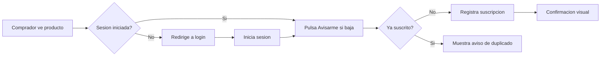
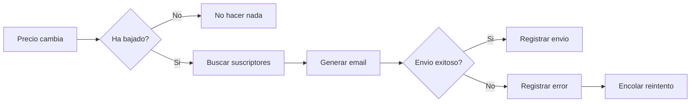

# Plantillas y ejemplos de historias de usuario

Referencia para el agente product-owner durante la generacion de historias.

## Plantilla base

```markdown
### HU-XX: Titulo descriptivo breve

**Contexto:**

[1-2 parrafos que explican el POR QUE de esta historia. Que problema resuelve,
que dolor alivia, que pasa si no se hace. El trasfondo de negocio y de usuario
que justifica esta funcionalidad.]

**Historia de usuario:**

Como [rol especifico del usuario],
quiero [accion concreta que el usuario realiza],
para [beneficio medible que obtiene el usuario].

**Diagrama de flujo:**

[Diagrama Mermaid del flujo principal del usuario para esta historia]

**Datos relevantes:**

[Tabla con campos, tipos, validaciones y ejemplos si la historia maneja datos]

| Campo | Tipo | Obligatorio | Validacion | Ejemplo |
|-------|------|-------------|-----------|---------|
| [campo] | [tipo] | [si/no] | [regla] | [ejemplo] |

**Criterios de aceptacion:**

ESCENARIO 1: [nombre descriptivo del escenario positivo]
Given [contexto inicial completo: no solo el estado, sino POR QUE el usuario
  esta en esa situacion, que ha pasado antes]
  And [condicion adicional si aplica]
When [accion exacta del usuario: que hace, con que datos, en que interfaz]
Then [expectativas detalladas: que debe pasar, que debe ver, que debe sentir]
  And [resultado adicional si aplica]

ESCENARIO 2: [nombre descriptivo del escenario negativo]
Given [contexto inicial completo con la situacion previa del usuario]
When [accion del usuario con datos invalidos o condicion de error, describiendo
  exactamente que introduce o que falla]
Then [comportamiento esperado ante la situacion, con tiempos de respuesta si aplica]
  And [feedback claro al usuario: mensaje exacto, ubicacion del mensaje, siguiente paso]

**Prioridad:** [Critica | Alta | Media | Baja]

**Referencias:** [patrones, articulos, documentacion o ejemplos relevantes]

**Notas de implementacion:** [sugerencias tecnicas concretas: patrones, consideraciones
de rendimiento, seguridad, accesibilidad. No codigo, pero si orientacion tecnica.]

**Notas:** [contexto adicional, dependencias, restricciones]
```

## Ejemplo completo: sistema de notificaciones

### HU-01: Suscripcion a notificaciones por email

**Contexto:**

Los compradores de la tienda online visitan repetidamente las paginas de productos que les interesan para comprobar si el precio ha bajado. Este comportamiento genera frustracion (el usuario pierde tiempo) y oportunidades perdidas (si no revisa justo cuando baja, otro comprador se lo lleva). Con un sistema de suscripcion a bajadas de precio, el comprador delega la vigilancia al sistema y solo actua cuando tiene sentido. Si no se implementa, seguiremos perdiendo conversiones de usuarios que abandonan productos caros esperando una oferta que nunca ven.

**Historia de usuario:**

Como comprador registrado en la tienda online,
quiero suscribirme a notificaciones de bajada de precio de un producto,
para recibir un aviso cuando el producto que me interesa este mas barato.

**Diagrama de flujo:**



**Datos relevantes:**

| Campo | Tipo | Obligatorio | Validacion | Ejemplo |
|-------|------|-------------|-----------|---------|
| producto_id | UUID | si | debe existir en catalogo activo | 550e8400-e29b-41d4-a716-446655440000 |
| usuario_id | UUID | si | usuario con sesion activa | 7c9e6679-7425-40de-944b-e07fc1f90ae7 |
| precio_actual | decimal | si | mayor que 0, 2 decimales | 89.99 |
| fecha_suscripcion | datetime | si | generada automaticamente | 2026-03-14T10:30:00Z |

**Criterios de aceptacion:**

ESCENARIO 1: Suscripcion exitosa a un producto disponible
Given el comprador ha iniciado sesion en la tienda hace menos de 24 horas, tiene una
  cuenta activa con email confirmado, y ha navegado hasta la pagina de detalle del
  producto "Auriculares BT-500" con precio 89.99 EUR. El producto esta en stock y
  visible en el catalogo publico.
  And no tiene ninguna suscripcion previa de precio para este producto.
When pulsa el boton "Avisarme si baja de precio" que aparece junto al precio del producto.
Then el sistema registra la suscripcion para ese producto y ese comprador en menos de 1 segundo.
  And muestra un mensaje de confirmacion inline (sin redireccion): "Te avisaremos si el
  precio de Auriculares BT-500 baja".
  And el boton cambia visualmente a "Dejar de seguir precio" con un icono diferenciado,
  indicando que la accion es reversible.
  And se registra la fecha y hora de la suscripcion en el historial de actividad del comprador.

ESCENARIO 2: Intento de suscripcion sin sesion iniciada
Given un visitante anonimo esta navegando la tienda sin haber iniciado sesion. Ha llegado
  a la pagina de detalle de un producto a traves de un enlace compartido o una busqueda.
  And ve el boton "Avisarme si baja de precio" pero no esta autenticado.
When pulsa el boton "Avisarme si baja de precio".
Then el sistema redirige a la pagina de inicio de sesion, guardando la URL del producto
  y la intencion de suscripcion en la sesion temporal.
  And tras iniciar sesion correctamente, el sistema completa la suscripcion automaticamente
  sin que el usuario tenga que volver a pulsar el boton.
  And redirige al usuario de vuelta a la pagina del producto con el mensaje de confirmacion
  visible y el boton ya cambiado a "Dejar de seguir precio".

ESCENARIO 3: Suscripcion duplicada al mismo producto
Given el comprador "Ana Garcia" ya esta suscrito a notificaciones del producto
  "Auriculares BT-500" desde hace 5 dias. Vuelve a visitar la pagina del producto
  para consultar sus especificaciones.
When pulsa el boton "Avisarme si baja de precio" en el mismo producto (el boton
  deberia mostrar "Dejar de seguir precio", pero por un error de cache aparece
  el boton original).
Then el sistema muestra un mensaje informativo: "Ya estas suscrito a las notificaciones
  de precio de este producto".
  And no crea una suscripcion duplicada (idempotencia).
  And corrige el estado visual del boton a "Dejar de seguir precio".

**Prioridad:** Alta

**Referencias:** Patron de suscripcion observer para notificaciones de precio. Similar a la funcionalidad de "Price Alert" de CamelCamelCamel o Idealo.

**Notas de implementacion:** Considerar un indice compuesto (usuario_id, producto_id) con restriccion UNIQUE para garantizar idempotencia a nivel de base de datos. La suscripcion debe ser un recurso REST independiente (/api/suscripciones-precio) para facilitar futuras extensiones (umbral de precio, multiples canales de notificacion).

**Notas:** Depende de que el sistema de precios tenga historico. La notificacion por email se implementa en HU-02.

---

### HU-02: Envio de notificacion cuando el precio baja

**Contexto:**

Una vez que el comprador se ha suscrito a las bajadas de precio (HU-01), el sistema necesita detectar cambios de precio y notificar de forma proactiva. Sin esta funcionalidad, la suscripcion no tiene ningun efecto practico y el usuario pierde la confianza en el sistema. El envio puntual y fiable de estas notificaciones es lo que convierte una visita pasiva en una compra: el usuario recibe el email, ve la oferta y actua. Si el email no llega o llega tarde, el usuario desconfia y deja de usar la funcionalidad.

**Historia de usuario:**

Como comprador suscrito a notificaciones de precio,
quiero recibir un email cuando el precio del producto baje,
para poder comprarlo en el momento mas conveniente sin estar revisando la tienda constantemente.

**Diagrama de flujo:**



**Datos relevantes:**

| Campo | Tipo | Obligatorio | Validacion | Ejemplo |
|-------|------|-------------|-----------|---------|
| producto_id | UUID | si | debe tener suscriptores activos | 550e8400-e29b-41d4-a716-446655440000 |
| precio_anterior | decimal | si | mayor que 0 | 89.99 |
| precio_nuevo | decimal | si | menor que precio_anterior | 69.99 |
| email_destino | string | si | formato email valido | ana@ejemplo.com |
| intentos_envio | integer | si | entre 0 y 3 | 0 |

**Criterios de aceptacion:**

ESCENARIO 1: Notificacion por bajada de precio
Given el comprador "Ana Garcia" (ana@ejemplo.com) esta suscrito a notificaciones del
  producto "Auriculares BT-500" desde hace 2 semanas. El precio actual almacenado en
  su suscripcion es 89.99 EUR. Ana tiene una cuenta activa con email confirmado y no
  ha cancelado la suscripcion.
  And el servicio de email transaccional esta operativo.
When el equipo de pricing actualiza el precio del producto a 69.99 EUR (una bajada
  del 22.2%) a traves del panel de administracion.
Then el sistema detecta la bajada de precio en menos de 5 minutos desde la actualizacion.
  And envia un email a ana@ejemplo.com con asunto: "El precio de Auriculares BT-500
  ha bajado a 69.99 EUR".
  And el cuerpo del email incluye: nombre del producto, imagen del producto, precio
  anterior (89.99 EUR) tachado, precio nuevo (69.99 EUR) destacado, porcentaje de
  ahorro (22%), y un boton con enlace directo a la pagina del producto.
  And se registra la fecha, hora y resultado del envio en el log de notificaciones.

ESCENARIO 2: El precio sube (no notificar)
Given el comprador esta suscrito a notificaciones del producto "Auriculares BT-500"
  con precio de referencia 89.99 EUR. La suscripcion lleva activa 10 dias sin
  ninguna notificacion previa.
  And el precio actual del producto es 89.99 EUR.
When el equipo de pricing sube el precio a 99.99 EUR porque ha aumentado la demanda.
Then el sistema detecta el cambio de precio pero determina que es una subida, no
  una bajada.
  And NO envia ninguna notificacion al comprador.
  And la suscripcion sigue activa con el precio de referencia original (89.99 EUR),
  de modo que si el precio baja por debajo de 89.99 EUR en el futuro, si se notifique.

ESCENARIO 3: Error en el envio del email
Given el sistema detecta una bajada de precio de 89.99 EUR a 74.99 EUR para el
  producto "Auriculares BT-500", que tiene 15 suscriptores activos. El proceso de
  envio ha comenzado y ha enviado correctamente los primeros 8 emails.
When intenta enviar el email numero 9 y el servicio de correo (SendGrid/SES) devuelve
  un error HTTP 503 (servicio no disponible temporalmente).
Then el sistema registra el error con el detalle del codigo de respuesta, timestamp
  y email afectado en el log de errores.
  And marca ese envio especifico como pendiente de reintento (estado: "retry_pending").
  And continua enviando los emails restantes (10 al 15) sin interrumpir el proceso.
  And programa un reintento del email fallido en 10 minutos (maximo 3 intentos,
  con backoff exponencial: 10min, 30min, 90min).
  And si los 3 intentos fallan, marca el envio como "failed" y genera una alerta
  para el equipo de operaciones.

**Prioridad:** Alta

**Referencias:** Patron de cola de mensajes con reintentos y dead-letter queue. Ver documentacion de Amazon SES sobre manejo de bounces y throttling.

**Notas de implementacion:** Usar una cola de mensajes (SQS, RabbitMQ) para desacoplar la deteccion de bajada de precio del envio de emails. Implementar backoff exponencial en los reintentos. Considerar batch processing si un producto popular tiene miles de suscriptores para no saturar el servicio de email.

**Notas:** Requiere integracion con un servicio de email transaccional (ej: SendGrid, SES). El reintento se implementa con una cola de mensajes.

## Anti-patrones: historias mal escritas

### Anti-patron 1: Rol generico

MAL:
```
Como usuario, quiero buscar productos, para encontrar lo que necesito.
```

BIEN:
```
Como comprador no registrado que visita la tienda por primera vez,
quiero buscar productos por nombre o categoria,
para encontrar rapidamente lo que busco sin tener que navegar por toda la tienda.
```

### Anti-patron 2: Accion vaga

MAL:
```
Como administrador, quiero gestionar los pedidos, para que todo funcione bien.
```

BIEN:
```
Como operador de logistica del almacen,
quiero filtrar los pedidos pendientes de envio por fecha de compra,
para preparar primero los pedidos mas antiguos y cumplir los plazos de entrega.
```

### Anti-patron 3: Beneficio no medible

MAL:
```
Como cliente, quiero que la pagina sea rapida, para tener mejor experiencia.
```

BIEN:
```
Como comprador que navega desde el movil con conexion 4G,
quiero que la pagina de listado de productos cargue en menos de 2 segundos,
para no abandonar la compra por lentitud de carga.
```

### Anti-patron 4: Criterio de aceptacion vago

MAL:
```
Given el usuario esta en la pagina
When hace la accion
Then funciona correctamente
```

BIEN:
```
Given el comprador esta en la pagina de checkout con 3 productos en el carrito
  And el total es 149.97 EUR
When introduce un codigo de descuento valido "VERANO20" (20% de descuento)
Then el precio total se actualiza a 119.98 EUR
  And se muestra el detalle del descuento: "-29.99 EUR (codigo VERANO20)"
  And el codigo aparece como aplicado con opcion de eliminarlo
```

### Anti-patron 5: Historia demasiado grande

MAL:
```
Como administrador, quiero un panel de gestion completo con usuarios, productos,
pedidos, informes y configuracion del sistema, para gestionar toda la tienda.
```

Esto son al menos 5 historias separadas. Descomponer en: gestion de usuarios, gestion de productos, gestion de pedidos, informes y configuracion.
