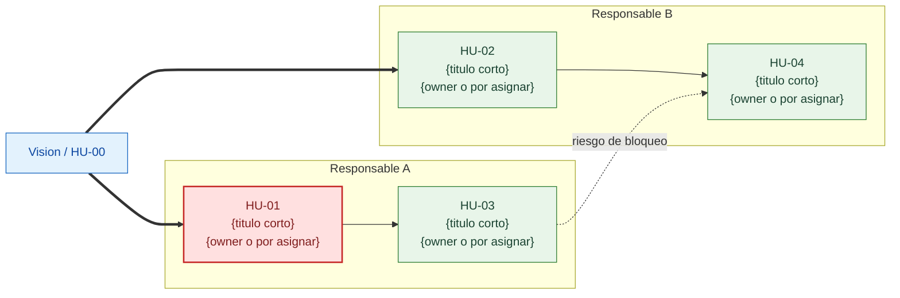
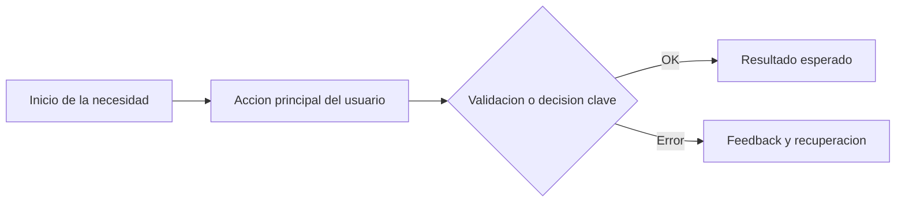
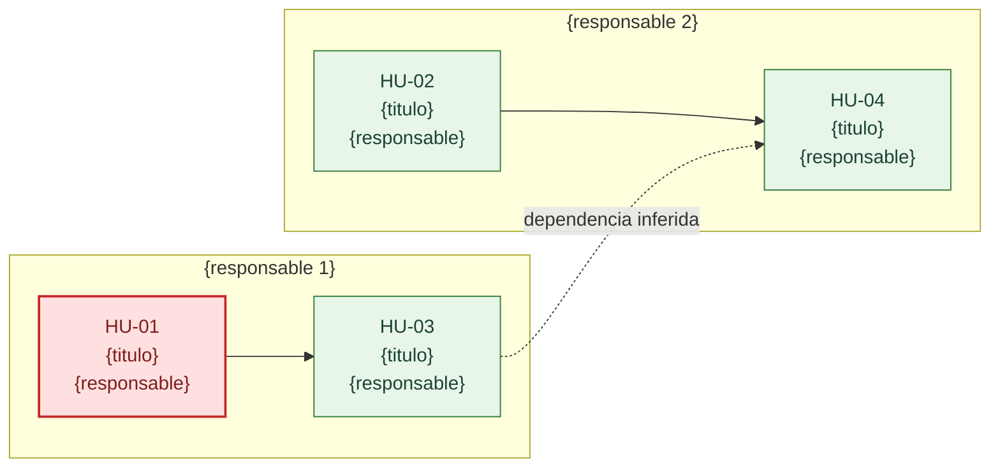

# Plantillas de ficheros Markdown

Referencia para la skill save-docs. Define las plantillas exactas de cada tipo de fichero que genera el plugin.

## vision.md

````markdown
# Vision de producto

> {Resumen de la vision en una frase}

## Usuario principal

{Descripcion del usuario principal: quien es, que hace, en que contexto trabaja}

## Problema

{Descripcion del problema que tiene el usuario: que le duele, que consecuencias tiene}

## Solucion propuesta

{Resumen de alto nivel de la solucion}

## Resultado esperado

{Que pasara cuando esto funcione: beneficios concretos y medibles}

## Restricciones

{Limitaciones tecnicas, de tiempo, de presupuesto o de negocio}

## Fuera de alcance

{Que NO se incluye en esta version}

## Mapa operativo y dependencias criticas

Vista ejecutiva del proyecto para evitar bloqueos y entender ownerships de un vistazo.



### Lectura rapida del mapa

- **Bloqueantes principales:** {historias que desbloquean a otras}
- **Riesgos de bloqueo:** {dependencias criticas o "sin riesgos relevantes"}
- **Owners actuales:** {resumen de personas asignadas o "pendiente de asignacion"}

---
*Generado por PSPO Agent | Ultima actualizacion: {DD/MM/AAAA}*
````

## HU-XX-titulo.md

```markdown
# HU-{XX}: {Titulo descriptivo}

| Campo | Valor |
|-------|-------|
| **Prioridad** | {Critica / Alta / Media / Baja} |
| **Estimacion** | {XS / S / M / L / XL} ({horas} h efectivas) |
| **Sprint** | {Sprint N / Sin asignar} |
| **Asignado a** | {Nombre (email) / Sin asignar} |
| **Estado** | {Borrador / Aprobada / Publicada en Trello / Rechazada} |
| **Creada** | {DD/MM/AAAA} |
| **Ultima modificacion** | {DD/MM/AAAA} |

## Contexto narrativo

{Explica por que esta historia importa, que problema resuelve, que pasa si no
se hace y cual es el impacto para negocio y usuario. Mejor largo y explicativo
que corto o telegrafico.}

## Historia de usuario

Como {rol especifico},
quiero {accion concreta},
para {beneficio medible}.

## Flujo operativo



## Criterios de aceptacion

### Escenario 1: {nombre del escenario}

Given {contexto inicial detallado}
  And {condicion adicional}
When {accion concreta del usuario}
Then {resultado esperado verificable}
  And {resultado adicional}

### Escenario 2: {nombre del escenario}

Given {contexto}
When {accion}
Then {resultado}

## Tabla de datos o reglas

Incluye esta seccion cuando ayude a explicar campos, validaciones, estados,
permisos o decisiones importantes.

| Elemento | Tipo o regla | Obligatorio | Validacion / Comportamiento | Ejemplo |
|----------|--------------|-------------|-----------------------------|---------|
| {campo} | {tipo} | {si/no} | {regla o estado} | {ejemplo} |

## Notas

{Contexto adicional, dependencias, restricciones tecnicas, riesgos, decisiones
de implementacion y referencias utiles}

---
*Generado por PSPO Agent*
```

## asignaciones.md

```markdown
# Asignaciones del sprint

Fecha: {DD/MM/AAAA}
Sprint: {Sprint N}

| Historia | Responsable | Email | Rol | Horas | Estado |
|----------|-------------|-------|-----|-------|--------|
| HU-01 | {nombre} | {email} | {rol} | {horas} h | {estado} |
| HU-02 | {nombre} | {email} | {rol} | {horas} h | {estado} |

## Carga por responsable

| Responsable | Historias | Horas |
|-------------|-----------|-------|
| {nombre} | {N} | {horas} h |
| {nombre} | {N} | {horas} h |

---
*Generado por PSPO Agent*
```

## dependencias.md

````markdown
# Mapa de dependencias

Ultima actualizacion: {DD/MM/AAAA}
Sprint: {Sprint N / Sin sprint}



## Dependencias

| Historia | Depende de | Tipo | Confianza | Estado |
|----------|------------|------|-----------|--------|
| HU-03 | HU-01 | Tecnica | Alta | Confirmada |
| HU-04 | HU-03 | Flujo | Media | Inferida |

## Bloqueantes principales

1. HU-01 -- desbloquea HU-03
2. HU-03 -- condiciona HU-04

## Riesgos

- {riesgo principal o "sin riesgos relevantes"}

---
*Generado por PSPO Agent*
````

## backlog.md

```markdown
# Product backlog

Ultima actualizacion: {DD/MM/AAAA}

## Historias priorizadas

| # | Historia | Prioridad | Talla | Horas | Sprint | Asignado | Estado | Fichero |
|---|----------|-----------|-------|-------|--------|----------|--------|---------|
| HU-01 | {titulo} | {prioridad} | {talla} | {horas} h | {sprint} | {asignado} | {estado} | [HU-01](historias/HU-01-titulo.md) |
| HU-02 | {titulo} | {prioridad} | {talla} | {horas} h | {sprint} | {asignado} | {estado} | [HU-02](historias/HU-02-titulo.md) |

## Resumen

- **Total:** {N} historias
- **Critica:** {X}
- **Alta:** {Y}
- **Media:** {Z}
- **Baja:** {W}

## Por estado

- **Aprobadas:** {A}
- **Publicadas en Trello:** {B}
- **Pendientes de revision:** {C}
- **Rechazadas:** {D}

---
*Generado por PSPO Agent*
```

## Reglas de formato

### Kebab-case para nombres de fichero

Transformacion de titulo a nombre de fichero:

| Titulo original | Nombre de fichero |
|----------------|-------------------|
| Registro de usuario con email | HU-01-registro-de-usuario-con-email.md |
| Busqueda por categoria y precio | HU-02-busqueda-por-categoria-y-precio.md |
| Notificacion de bajada de precio | HU-03-notificacion-de-bajada-de-precio.md |

Reglas:
1. Todo a minusculas.
2. Espacios se reemplazan por guiones.
3. Se eliminan caracteres especiales (tildes, puntos, comas, parentesis).
4. Maximo 50 caracteres en la parte del titulo (sin contar el prefijo HU-XX-).
5. Si supera 50 caracteres, se trunca en la ultima palabra completa.

### Fechas

Las fechas se muestran en formato espanol: DD/MM/AAAA (ejemplo: 14/03/2026). Todos los marcadores `{DD/MM/AAAA}` en las plantillas deben sustituirse por la fecha actual en ese formato.

### Markdown limpio

- Una linea en blanco entre secciones.
- Sin HTML embebido.
- Sin emojis.
- Tablas alineadas con pipes.
- Bloques de codigo con triple backtick y lenguaje especificado si aplica.
